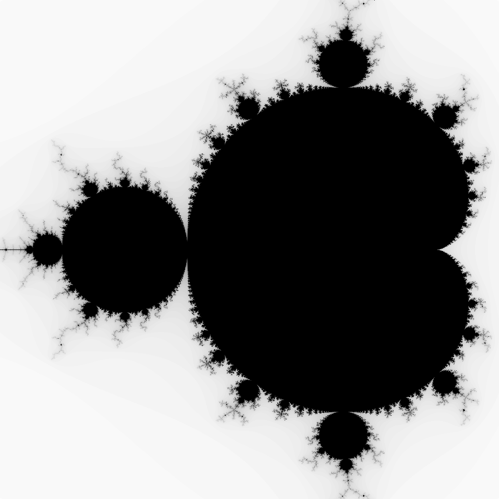

# Mandelbrot Generator
A simple mandelbrot generator/viewer in  plain java.

## What is the Mandelbrot set?
The mandelbrot set is the set of complex numbers that can be derived by the function $f_{c}(z)=z^{2}+c$ where we start with $z=0$ and iterate the sequence $f_{c}(0), f_{c}(f_{c}(0)), f_{c}(f_{c}(f_{c}(0)))$ etc.   
With this we determine if a complex point $c$ lies in the mandelbrot set by determining if the formula $f_{c}(z)=z^{2}+c$ will result in a bounded value over many iterations, if this is true then we color the pixel corresponding to the point $c$ in black, if not we will color the point $c$ in a shade of gray where brighter colors mean a "highly chaotic" output of the formula and darker colors mean a more "uniform" or less "chaotic" output.  
An example of the mandelbrot set:   
